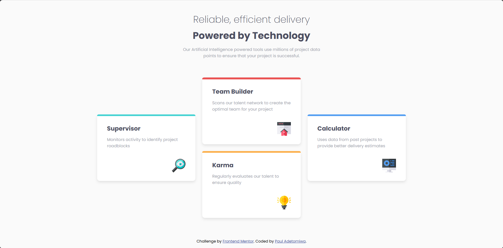

# Frontend Mentor - Four card feature section solution

This is a solution to the [Four card feature section challenge on Frontend Mentor](https://www.frontendmentor.io/challenges/four-card-feature-section-weK1eFYK). Frontend Mentor challenges help you improve your coding skills by building realistic projects.  

## Table of contents

- [Overview](#overview)
  - [Screenshot](#screenshot)
  - [Links](#links)
- [My process](#my-process)
  - [Built with](#built-with)
  - [What I learned](#what-i-learned)
- [Author](#author)
- [New](#new)


## Overview

- This is a solution to a four card feature section challenge on Frontend Mentor. It was made to be responsive, with the ability to view the optimal layout depending on their device's screen size. It also involved using CSS Grid, which is a very optimal way of arranging elements across th webpage

### Screenshot



### Links

- https://github.com/PaulAdetomiwa/four-card-feature/blob/main/index.html


## My process

### Built with

- Semantic HTML5 markup
- CSS custom properties
- CSS Grid
- CSS Flexbox 
- Media queries

### What I learned

```html
    <div class="container">
      <div class="columns">
        <div class="card">
          <div class="bar1"></div>
          <h3>Supervisor</h3>
          <span>Monitors activity to identify project roadblocks</span>
          <div class="img-cntr"></div>
        </div>
      </div>
      <div class="columns">
        <div class="card">
          <div class="bar2"></div>
          <h3>Team Builder</h3>
          <span>Scans our talent network to create the optimal team for your project</span>
          <div class="img-cntr"></div>
        </div>
        <div class="card">
          <div class="bar3"></div>
          <h3>Karma</h3>
          <span>Regularly evaluates our talent to ensure quality</span>
          <div class="img-cntr"></div>
        </div>
      </div>
      <div class="columns">
        <div class="card">
          <div class="bar4"></div>
          <h3>Calculator</h3>
          <span>Uses data from past projects to provide better delivery estimates</span>
          <div class="img-cntr"></div>
        </div>
      </div>
    </div>
```
- This was pretty much most of the work for the HTML part. Putting the cards in containers so the layout can be achievable.

```css
.columns:nth-child(1) {
      grid-column: 1 / 2;
      grid-row: 1 / 2;
      align-content: center;
    }

    .columns:nth-child(2) {
      grid-column: 2 / 3;
      grid-row: 1 / 2;
      display: flex;
      flex-direction: column;
      gap: 20px;
    }

    .columns:nth-child(3) {
      grid-column: 3 / 4;
      grid-row: 1 / 2;
      align-content: center;
    }
```
- This was the most vital part of the layout, especially when it came to the use of CSS grid. 

- The width and heights of the elements were set using responsiveness-friendly metrics, mostly percentages.

## Author

- Website - [Paul Adetomiwa](https://github.com/PaulAdetomiwa)
- Frontend Mentor - [@PaulAdetomiwa](https://www.frontendmentor.io/profile/PaulAdetomiwa)
- X - [@AdewolePaul6](https://www.x.com/AdewolePaul6)

## New
- So, I've decided to start using external CSS for learning purposes, but I personally have a preference for the "<style>" tag and just writing all the css within the same file.
